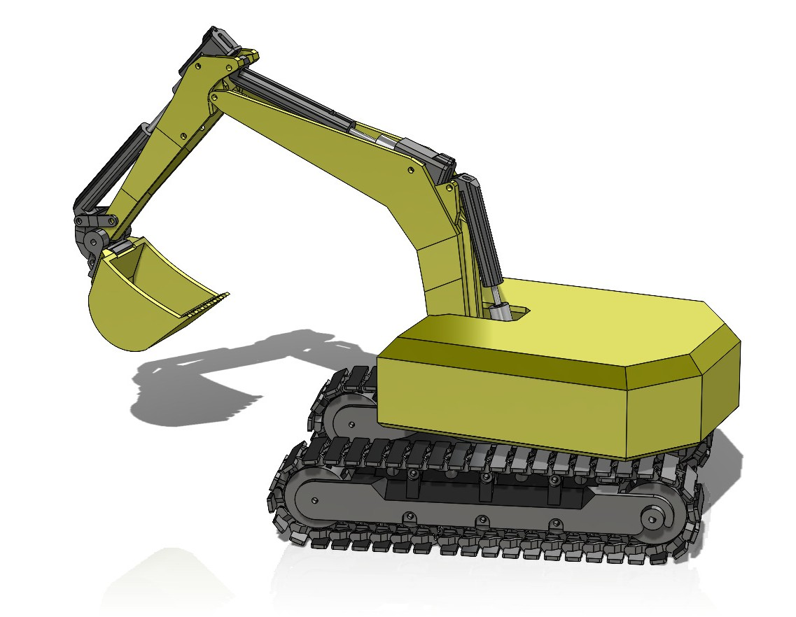
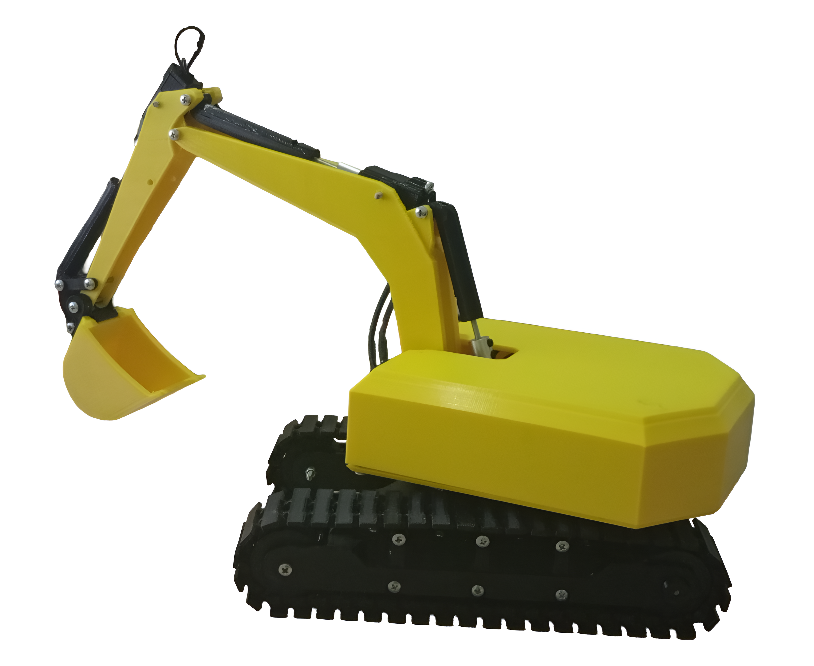

Markdown
# Teleoperation-Assisted Autonomous Excavator Design & Modeling 🚜🤖


This repository contains the complete conceptual design, kinematic modeling, ROS-based autonomous algorithms, and embedded systems architecture for a teleoperation-assisted autonomous excavator.

<p align="center">
  
  
</p>

## 🎯 Project Overview
In industries with harsh and hazardous environments like mining and construction, minimizing human exposure while maximizing operational efficiency is a critical engineering challenge. This project aims to transform traditional heavy machinery into smart, situational-aware systems. By developing a digital twin of a CAT 349E excavator, the system achieved an 84% operational success rate in end-to-end autonomous dig-and-load cycles across 100 simulation trials. 

## ⚙️ Technical Specifications
* **Simulation Environment:** ROS Noetic & Gazebo (ODE Physics Engine)
* **Base Model:** 1:10 scaled Caterpillar 349E excavator
* **Perception:** Dual RGB-D Depth Cameras (640x480 VGA, 10Hz)
* **Hardware Prototyping:** Dual-Core ESP32 microcontroller with PCA9685 PWM driver and DRV8833 H-Bridges
* **Actuators:** N20 DC Gearmotors (50 RPM for torque, 1000 RPM for linear actuators)
* **Power Management:** 7.4V 2S Li-ion battery (2450 mAh) managed by a 13A BMS

## 🔬 Engineering Methodology & Algorithms
All simulation and autonomous control phases were executed using **ROS Noetic**, while the physical prototype was driven by custom C++ embedded firmware. The engineering workflow includes:

1. **Kinematic Modeling:** The 4-DOF manipulator (swing, boom, arm, bucket) was mapped using URDF. Inverse kinematics were solved numerically via the MoveIt! framework and KDL library to avoid singularity states.
2. **3D Perception & Mapping:** Point Cloud data from RGB-D sensors were converted into volumetric maps using the OctoMap algorithm to scan dynamic terrains.
3. **Computer Vision:** Target truck localization was achieved dynamically using HSV color space masking and image moments via OpenCV.
4. **Trajectory Generation:** To eliminate mechanical jerks during operations, a custom Cosine Interpolation (S-Curve) motor was developed for smooth acceleration.
5. **Hardware Proof of Concept:** A 6-axis open-loop physical prototype was manufactured, featuring low-latency teleoperation controlled by a Sony DualSense gamepad over Wi-Fi/Bluetooth.

<p align="center">
  
  
</p>

## 🛠️ Dependencies & Installation

### Prerequisites & Dependencies
To run the simulation and autonomy nodes, ensure you have the following environment set up:
* **OS:** Ubuntu 20.04 LTS
* **Middleware:** ROS Noetic (Desktop Full Recommended)
* **Physics Engine:** Gazebo 11
* **ROS Packages:** `ros-noetic-moveit`, `ros-noetic-octomap-ros`, `ros-noetic-octomap-mapping`
* **Python Libraries:** `opencv-python`, `numpy`
* **Embedded Toolchain:** PlatformIO IDE (for ESP32 firmware verification)

### Installation & Setup

1. **Create a Catkin Workspace (if you don't have one):**
   ```bash
   mkdir -p ~/catkin_ws/src
   cd ~/catkin_ws/src
Clone the Repository:

Bash
git clone [https://github.com/erdogan-kir/ros-autonomous-excavator-design.git](https://github.com/erdogan-kir/ros-autonomous-excavator-design.git) .
Install ROS Dependencies:

Bash
cd ~/catkin_ws
rosdep install --from-paths src --ignore-src -r -y
Build the Workspace:

Bash
catkin_make
source devel/setup.bash
Run the Simulation:

Bash
roslaunch Exca-1 empty_world.launch
📂 Repository Structure
/ros_workspace: Contains ROS Noetic packages, Gazebo simulation environments, URDF models, MoveIt! configurations, and Python/OpenCV autonomy scripts.

/embedded_systems: PlatformIO-based C++ source code for ESP32 teleoperation and motor driver control logic.

/cad_files: SolidWorks native files and exported .STEP/.STL files for 3D printing of the 1:10 scale physical prototype.

/documents: Comprehensive engineering design report (in Turkish) detailing dynamic equations, electrical schematics, and simulation outputs.

/media: Contains project videos and high-resolution images demonstrating the Gazebo simulation and the physical prototype in action.

🔮 Future Works
In the next phase, the system architecture is planned to be migrated from ROS Noetic to ROS 2 (Humble/Iron). This will leverage DDS (Data Distribution Service) for real-time communication, enhancing the stability of autonomous cycles and enabling synchronized multi-agent operations within the same construction network.

Designed by Erdoğan Kır as a senior Mechatronics Engineering design project.

NON-COMMERCIAL USE ONLY

Teleoperasyon Destekli Otonom Ekskavatör Tasarımı ve Modellemesi 🚜🤖
Bu depo, teleoperasyon destekli otonom bir ekskavatöre ait kavramsal tasarım, kinematik modelleme, ROS tabanlı otonom algoritmalar ve gömülü sistem mimarisini içermektedir.

🎯 Proje Özeti
Madencilik ve inşaat gibi zorlu saha koşullarına sahip sektörlerde, operasyonel verimliliği maksimize ederken insan riskini minimize etmek kritik bir mühendislik hedefidir. Bu proje, geleneksel ağır iş makinelerini çevresel farkındalığa sahip akıllı sistemlere dönüştürmeyi amaçlamaktadır. CAT 349E ekskavatörünün dijital ikizi geliştirilmiş ve sistem, 100 simülasyon denemesinde uçtan uca otonom kazı-yükleme döngülerinde %84 operasyonel başarı oranına ulaşmıştır.

⚙️ Teknik Özellikler
Simülasyon Ortamı: ROS Noetic ve Gazebo (ODE Fizik Motoru)

Referans Model: 1:10 ölçekli Caterpillar 349E ekskavatör

Algılayıcılar: Çift RGB-D Derinlik Kamerası (640x480 VGA, 10Hz)

Donanım Prototipi: PCA9685 PWM sürücü ve DRV8833 köprülerine sahip Çift Çekirdekli ESP32 mikrodenetleyici

Aktüatörler: N20 Redüktörlü DC Motorlar (Tork için 50 RPM, lineer aktüatörler için 1000 RPM)

Güç Yönetimi: 13A BMS ile yönetilen 7.4V 2S Li-ion batarya (2450 mAh)

🔬 Mühendislik Metodolojisi ve Algoritmalar
Tüm simülasyon ve otonom kontrol aşamaları ROS Noetic kullanılarak gerçekleştirilmiş, fiziksel prototip ise özel C++ gömülü yazılımlarla sürülmüştür. Mühendislik iş akışı şunları içerir:

Kinematik Modelleme: 4 serbestlik dereceli manipülatör (kule, bom, arm, kova) URDF kullanılarak modellenmiştir. Ters kinematik hesaplamaları, tekillik (singularity) durumlarından kaçınmak için MoveIt! ve KDL kütüphanesi ile nümerik olarak çözülmüştür.

3B Algılama ve Haritalama: Dinamik arazileri taramak için RGB-D sensörlerden gelen Nokta Bulutu (Point Cloud) verileri, OctoMap algoritması kullanılarak hacimsel haritalara dönüştürülmüştür.

Bilgisayarlı Görü: Hedef kamyonun dinamik tespiti, OpenCV üzerinden HSV renk uzayı maskelemesi ve görüntü momentleri (image moments) kullanılarak sağlanmıştır.

Yörünge Planlaması: Operasyonlar sırasında mekanik sarsıntıları önlemek ve ivmelenmeyi yumuşatmak için Kosinüs İnterpolasyon (S-Curve) motoru geliştirilmiştir.

Donanımsal İspat (Proof of Concept): Wi-Fi/Bluetooth üzerinden Sony DualSense oyun kumandası ile kontrol edilen, düşük gecikmeli teleoperasyon yeteneğine sahip 6 eksenli açık çevrim bir fiziksel prototip üretilmiştir.

🛠️ Bağımlılıklar ve Kurulum Talimatları
Gereksinimler ve Bağımlılıklar
Simülasyonu ve otonomi düğümlerini çalıştırmak için bilgisayarınızda aşağıdaki ortamın kurulu olması gerekmektedir:

İşletim Sistemi: Ubuntu 20.04 LTS

Robot İşletim Sistemi: ROS Noetic (Desktop Full Önerilir)

Fizik Motoru: Gazebo 11

Gerekli ROS Paketleri: ros-noetic-moveit, ros-noetic-octomap-ros, ros-noetic-octomap-mapping

Python Kütüphaneleri: opencv-python, numpy

Gömülü Yazılım Araçları: PlatformIO IDE (ESP32 yazılımının derlenmesi için)

Kurulum Adımları
Bir Catkin Çalışma Alanı Oluşturun (Eğer mevcut değilse):

Bash
mkdir -p ~/catkin_ws/src
cd ~/catkin_ws/src
Depoyu Klonlayın:

Bash
git clone [https://github.com/erdogan-kir/ros-autonomous-excavator-design.git](https://github.com/erdogan-kir/ros-autonomous-excavator-design.git) .
ROS Bağımlılıklarını Kontrol Edin:

Bash
cd ~/catkin_ws
rosdep install --from-paths src --ignore-src -r -y
Çalışma Alanını Derleyin:

Bash
catkin_make
source devel/setup.bash
Simülasyonu Başlatın:

Bash
roslaunch Exca-1 empty_world.launch
📂 Depo Yapısı
/ros_workspace: ROS Noetic paketlerini, Gazebo simülasyon ortamlarını, URDF modellerini, MoveIt! yapılandırmalarını ve Python/OpenCV otonomi algoritmalarını içerir.

/embedded_systems: ESP32 teleoperasyon ve motor sürücü kontrol mantığı için PlatformIO tabanlı C++ kaynak kodları.

/cad_files: 1:10 ölçekli fiziksel prototipin 3B basımı için SolidWorks yerel parça dosyaları ve dışa aktarılmış .STEP/.STL dosyaları.

/documents: Dinamik denklemleri, elektronik şemaları ve simülasyon çıktılarını detaylandıran kapsamlı mühendislik bitirme raporu.

/media: Gazebo simülasyonunu ve fiziksel prototipin çalışmasını gösteren proje videolarını ve yüksek çözünürlüklü görselleri içerir.

🔮 Gelecek Çalışmalar
Sistemin bir sonraki aşamasında, ROS Noetic mimarisinden ROS 2 (Humble/Iron) ortamına geçiş yapılması planlanmaktadır. Bu sayede DDS (Data Distribution Service) altyapısı kullanılarak gerçek zamanlı haberleşme sağlanacak ve aynı şantiye ağında birden fazla aracın senkronize çalışabilmesi (multi-agent) mümkün olacaktır.

Mekatronik Mühendisliği bitirme projesi olarak Erdoğan Kır tarafından tasarlanmıştır.

SADECE TİCARİ OLMAYAN KULLANIM İÇİNDİR
